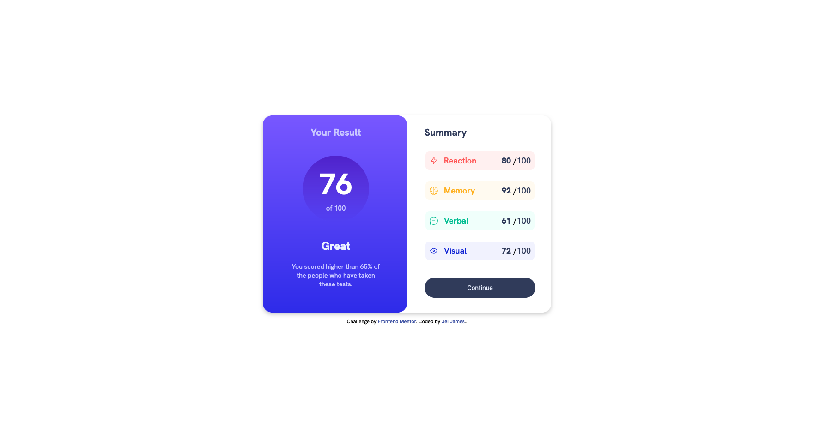

# Frontend Mentor - Results summary component solution

This is a solution to the [Results summary component challenge on Frontend Mentor](https://www.frontendmentor.io/challenges/results-summary-component-CE_K6s0maV). Frontend Mentor challenges help you improve your coding skills by building realistic projects. 

## Table of contents

- [Overview](#overview)
  - [The challenge](#the-challenge)
  - [Screenshot](#screenshot)
  - [Links](#links)
- [My process](#my-process)
  - [Built with](#built-with)
  - [What I learned](#what-i-learned)
  - [Useful resources](#useful-resources)
- [Author](#author)


**Note: Delete this note and update the table of contents based on what sections you keep.**

## Overview

### The challenge

Users should be able to:

- View the optimal layout for the interface depending on their device's screen size
- See hover and focus states for all interactive elements on the page
- **Bonus**: Use the local JSON data to dynamically populate the content

### Screenshot




### Links

- Solution URL: [Solution Page](https://www.frontendmentor.io/solutions/results-summary-component-solution-67YvkpmxFB)
- Live Site URL: [Live Site](https://aquamarine-kelpie-3a0ae0.netlify.app/)

## My process

### Built with

- Semantic HTML5 markup
- CSS custom properties
- Flexbox
- Mobile-first workflow


### What I learned

I had fun learning how to add the score results dynamically using the data.json file. I renamed it to result to assist me in understanding how to utilize the data.json file.  Some js code I'm proud of:


``` js 
for (const key of data) {

    const listItem = document.createElement("li");
    listItem.innerHTML = `<div class="listContainer ${key.category}">
                      
                     <span class="Cat" >${key.category}</span>  
                     <span class= "score">${key.score}  </span> / 
                     <span style="font-weight: 500; color: hsl(224, 30%, 27%);">100</span>
                    </div>`


    myList.append(listItem);


  }

```


### Useful resources

- [Response: json() method](https://developer.mozilla.org/en-US/docs/Web/API/Response/json#content) - This helped me for XYZ reason. I really liked this pattern and will use it going forward.


## Author

- Website - [Jei James](https://jeijames.netlify.app/)
- Frontend Mentor - [@carrot10pumpkin](https://www.frontendmentor.io/profile/carrot10pumpkin)


